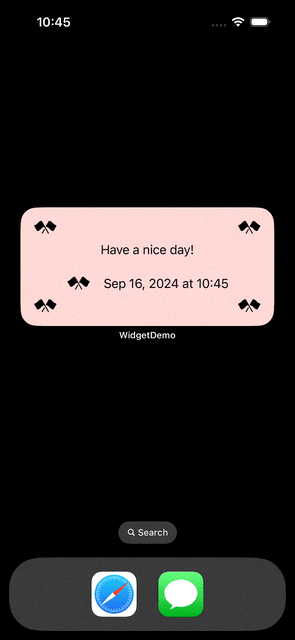
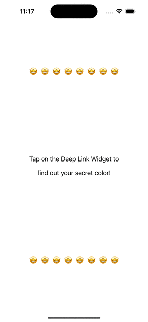
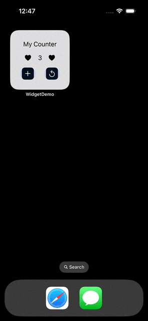
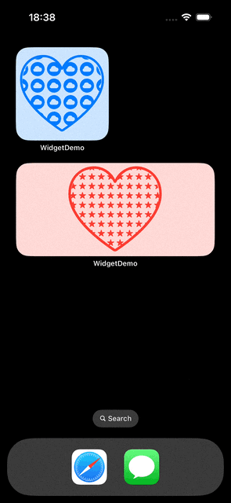

# SwiftUI WidgetKit Demo
Demos for using [WidgetKit](https://developer.apple.com/documentation/widgetkit/) with SwiftUI.

- [Basic Static Widget](#basic-static-widget)
- [Widget with Deep Link](#widget-with-deep-link)
- [Interactive Widget](#interactive-widget)
- [Configurable Widget](#configurable-widget)
- [Live Activity (Widget)](#live-activity-widget)

## Basic Static Widget
[Demo](./SFStaticWidget/) for static widget, a type that doesn't need any configuration by the user.

This demo also includes the following.

- Static vs dynamic timeline entries
- Widget contents based on widget size ([WidgetFamily](https://developer.apple.com/documentation/widgetkit/widgetfamily))

For more details, please check out [Static Widgets with WidgetKit](https://medium.com/@itsuki.enjoy/swiftui-static-widgets-with-widgetkit-b8b4a4960457).

Apple Reference: [Creating a widget extension](https://developer.apple.com/documentation/widgetkit/creating-a-widget-extension#Generate-a-preview-for-the-widget-gallery)

## Widget with Deep Link
[Demo](./DeepLinkWidget/) for passing data and linking to specific view from widgets using Deep Link.

Specially, deep linking with

- [widgetUrl](https://developer.apple.com/documentation/swiftui/view/widgeturl(_:))
- [Link](https://developer.apple.com/documentation/swiftui/link)

For more details, please check out [Pass Data and Link to Specific View from Widgets](https://medium.com/@itsuki.enjoy/swiftui-pass-data-and-link-to-specific-view-from-widgets-b68b8cae5658).

Apple Reference: [Linking to specific app scenes from your widget or Live Activity](https://developer.apple.com/documentation/widgetkit/linking-to-specific-app-scenes-from-your-widget-or-live-activity)

## Interactive Widget
[Counter Demo](./InteractiveWidget/) for an interactive widget.

This example also shows how we can share and sync data (the counter value) between widget(s) and the main app using `App Group` and `UserDefaults`.

For more details, please check out [Add Controls (Interactivity) to Widgets](https://medium.com/gitconnected/swiftui-add-controls-interactivity-to-widgets-b932c0fc16c1).

Apple Reference: [Adding interactivity to widgets and Live Activities](https://developer.apple.com/documentation/widgetkit/adding-interactivity-to-widgets-and-live-activities)

## Configurable Widget
[Demo](./ConfigurableWidget/) for an user-configurable widget.

This example also shows how to
- Use Custom data type for App Intent Parameter using  [`AppEntity`](https://developer.apple.com/documentation/AppIntents/AppEntity)
- Implement default query to use to retrieve entity property instances by creating a struct conforming to [`EntityQuery`](https://developer.apple.com/documentation/AppIntents/EntityQuery)
- Use [`DynamicOptionsProvider`](https://developer.apple.com/documentation/appintents/dynamicoptionsprovider) to provide a dynamic list of options for a parameter
- Configure the widget edit view using [`ParameterSummary`](https://developer.apple.com/documentation/appintents/appintent/parametersummary-4vgic)
- Access configurations (user customized values) in our main App with `NSUserActivity` and `onContinueUserActivity(_:perform:)`

For more details, please check out [Configurable Widget](https://medium.com/@itsuki.enjoy/swiftui-configurable-widget-to-let-our-user-choose-4a54e398f42f).

Apple Reference: [Making a configurable widget](https://developer.apple.com/documentation/widgetkit/making-a-configurable-widget)

## Live Activity (Widget)
[Demo](./LiveWidget/) for a live activity (widget) displaying the health point (energy) left in a target.

Specifically, this demo includes the following.
- Presenting a Live Activity (Lock screen presentation and Dynamic Island) describing the energy / healthPoint of a target
- use `widgetURL` to pass data and link to view in our main app
- use `AppIntent` to add controls to the live activity: boost the target energy within the activity without opening the container app
- Start, retrieve, update, end, and track a activity from container app

For more details, please check out [Present Live Data with Live Activity (Widget)](https://medium.com/@itsuki.enjoy/swiftui-present-live-data-with-live-activity-widget-e33d8740f0fe).

Apple Reference: [Displaying live data with Live Activities](https://developer.apple.com/documentation/ActivityKit/displaying-live-data-with-live-activities)

